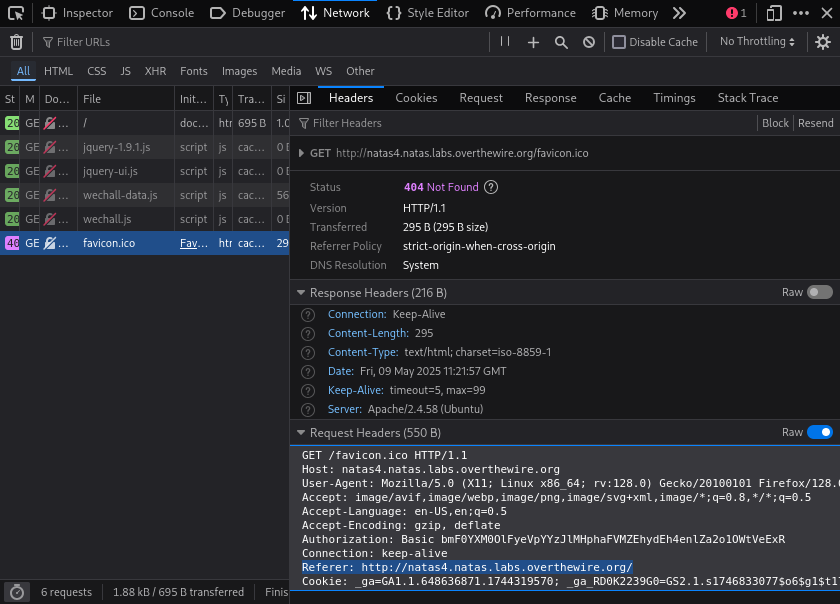
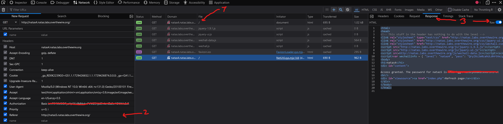

# Natas Level 3 → Level 4

## 🧠 Goal

Find password to the next level

---

## 🔐 Credentials

- **Username:** `natas4`  
- **Host:** `http://natas4.natas.labs.overthewire.org`   
- **Port:** `80` (HTTP)  
- **Password:** `QryZXc2e0zahULdHrtHxzyYkj59kUxLQ` 

---

## 🖥️ Commands Used

```bash
└─$ curl -u natas4:QryZXc2e0zahULdHrtHxzyYkj59kUxLQ http://natas4.natas.labs.overthewire.org  
<html>
<head>
<!-- This stuff in the header has nothing to do with the level -->
<link rel="stylesheet" type="text/css" href="http://natas.labs.overthewire.org/css/level.css">
<link rel="stylesheet" href="http://natas.labs.overthewire.org/css/jquery-ui.css" />
<link rel="stylesheet" href="http://natas.labs.overthewire.org/css/wechall.css" />
<script src="http://natas.labs.overthewire.org/js/jquery-1.9.1.js"></script>
<script src="http://natas.labs.overthewire.org/js/jquery-ui.js"></script>
<script src=http://natas.labs.overthewire.org/js/wechall-data.js></script><script src="http://natas.labs.overthewire.org/js/wechall.js"></script>
<script>var wechallinfo = { "level": "natas4", "pass": "QryZXc2e0zahULdHrtHxzyYkj59kUxLQ" };</script></head>
<body>
<h1>natas4</h1>
<div id="content">

Access disallowed. You are visiting from "" while authorized users should come only from "http://natas5.natas.labs.overthewire.org/"
<br/>
<div id="viewsource"><a href="index.php">Refresh page</a></div>
</div>
</body>
</html>

┌──(amro㉿amro)-[~]
└─$ curl -u natas4:QryZXc2e0zahULdHrtHxzyYkj59kUxLQ http://natas4.natas.labs.overthewire.org \
> -H "Referer: http://natas5.natas.labs.overthewire.org/"
<html>
<head>
<!-- This stuff in the header has nothing to do with the level -->
<link rel="stylesheet" type="text/css" href="http://natas.labs.overthewire.org/css/level.css">
<link rel="stylesheet" href="http://natas.labs.overthewire.org/css/jquery-ui.css" />
<link rel="stylesheet" href="http://natas.labs.overthewire.org/css/wechall.css" />
<script src="http://natas.labs.overthewire.org/js/jquery-1.9.1.js"></script>
<script src="http://natas.labs.overthewire.org/js/jquery-ui.js"></script>
<script src=http://natas.labs.overthewire.org/js/wechall-data.js></script><script src="http://natas.labs.overthewire.org/js/wechall.js"></script>
<script>var wechallinfo = { "level": "natas4", "pass": "QryZXc2e0zahULdHrtHxzyYkj59kUxLQ" };</script></head>
<body>
<h1>natas4</h1>
<div id="content">

Access granted. The password for natas5 is 0n35PkggAPm2zbEpOU802c0x0Msn1ToK
<br/>
<div id="viewsource"><a href="index.php">Refresh page</a></div>
</div>
</body>
</html>
```


___
## Anoter Solution
Right click on the main request then presse edit and resend then add Referer with http://natas5.natas.labs.overthewire.org



---


## 💡 Tips
Theory

The communication between the client (our machine) and the server (that hosts the website) is done by a request-response. We sent a request for a certain page and the server sends the response with the content. Generally, they will follow different protocols and structures, which depend on the service. In this case, it is HTTP (Hypertext Transfer Protocol). The request generally includes the request method (GET, POST,…), the requested URL and the protocol version. However, it can also include additional, potentially needed information, through so-called request headers. There are many such fields, some more common than others. Relevant ones for this challenge are ‘Authorization’, which would include the credentials for the website and ‘Referer’, which is the URL/webpage from which the request is sent. Generally, all this is handled by our browser and we do not have to worry about it. It is however possible to manipulate requests
___

## 📤 Output
```bash
0n35PkggAPm2zbEpOU802c0x0Msn1ToK
```
